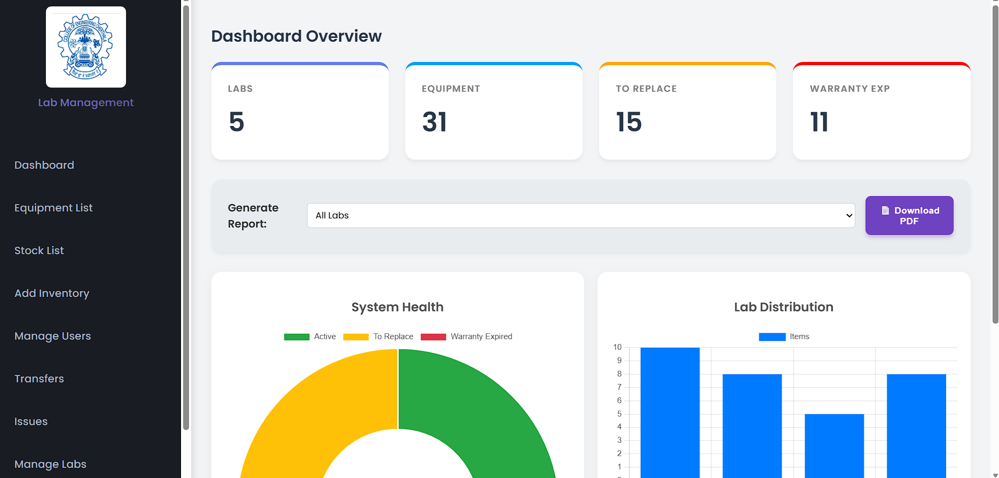

# 💻 Lab Management System

A full-stack web application built using **Node.js, Express.js, Vanilla JavaScript, and MySQL** to centralize laboratory inventory management. The system features role-based access control, Excel import using SheetJS, warranty and issue tracking, equipment transfers, and report generation, reducing manual effort and improving inventory management efficiency.

---

## 🚀 Features

- Role-Based Access Control (Admin, Lab Staff, Approver)
- Equipment Inventory Management
- Excel Import using SheetJS
- Equipment Transfer & Approval Workflow
- Warranty Tracking
- Issue Reporting
- Dashboard & Reports

---

## 🛠️ Tech Stack

- **Frontend:** HTML, CSS, JavaScript
- **Backend:** Node.js, Express.js
- **Database:** MySQL
- **ORM:** Sequelize
- **Library:** SheetJS

---

## 📸 Screenshots

### Login Page

### Dashboard

### Add Equipment

### Equipment List

### Excel Import

### Stock List

### Issue List

### Report Issue

### Transfer Request

### Transfer Approval

